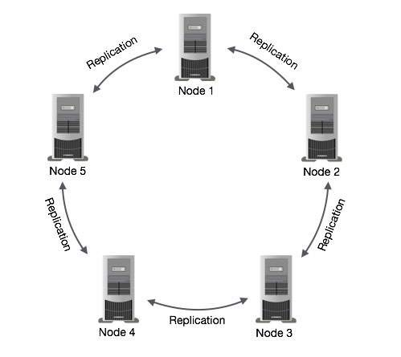

# 195410253_M.Ryan-Rezaldy
UTS Pengenalan BigData
## Cari dan sebutkan 3 DBMS yang bisa digunakan untuk mengelola big data
===========================================================================
**Jawaban**
### Riak
Riak mengklaim sebagai database terdistribusi open source paling kuat yang pernah dimasukkan ke dalam produksi. Penggunanya termasuk Comcast, Yammer, Voxer, Boeing, SEOmoz, Joyent, Kiip.me, DotCloud, Formspring, pemerintah Denmark, dan banyak lagi.
### MongoDB
MongoDB dirancang untuk mendukung database humongous. Database NoSQL dengan penyimpanan document-oriented, full index support, replication dan high availability, dan banyak lagi.
### Cassandra
Awalnya dikembangkan oleh Facebook, database NoSQL ini sekarang dikelola oleh Apache Foundation. Cassandra banyak digunakan oleh organisasi dengan active dataset besar termasuk Netflix, Twitter, Urban Airship, Constant Contact, Reddit, Cisco dan Digg.
## CCarilah contoh masalah big data yang bisa dikelola menggunakan salah satu DBMS tersebut, jelaskan mulai dari instalasi sampai CRUD untuk data menggunakan DBMS tersebut. Asumsikan anda akan memecahkan masalah big data yang sudah anda cari contoh tadi, jelaskan kira-kira bagaimana arsitektur dari solusi big data menggunakan DBMS tersebut, gambarkan diagramnya.
===========================================================================
**Jawaban**
## Cassandra
Cassandra di desain awal untuk menghandle Big Data yang terdiri dari banyak titik-titik (node) yang terpisah-pisah dan saling bekerjasama nyaris tanpa ada kesalahan.
Cassandra memiliki peer-to-peer sistem terdistribusi di seluruh node, dan data didistribusikan di antara semua node dalam sebuah cluster.
Semua node dalam sebuah cluster memainkan peran yang sama. Setiap node independen dan pada saat yang sama saling berhubungan ke node lain.
Setiap node dalam sebuah cluster dapat menerima membaca dan menulis permintaan, terlepas dari mana data sebenarnya terletak di cluster.
Ketika sebuah node performanya turun, membaca permintaan / tulis dapat dilayani dari node lain dalam jaringan.Replikasi data di Cassandra disebut dengan istilah Gossip Protocol dimana satu atau lebih node dalam sebuah Cluster sebagai replika untuk bagian tertentu dari data. Jika terdeteksi bahwa beberapa node datanya out of date, Cassandra akan mengembalikan nilai terbaru untuk klien. Setelah mendapatkan nilai kembalian terbaru, Cassandra melakukan perbaikan membaca di latar belakang untuk memperbarui nilai-nilai yang out of date.

